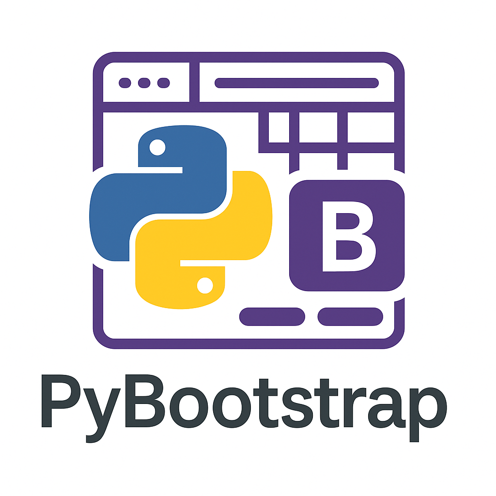

# Python Bootstrap-Template mit `.venv`- und `.env` Support



Dieses Template nutzt PEP 8, Type Hints, Docstrings und einen vordefinierten Workspace für sauberen Python-Code.  
Außerdem bietet es ein portables Start-Template für Python-Anwendungen mit folgenden Features:  

- Automatische Erstellung einer virtuellen Umgebung (`.venv`)  
- Automatische Installation von Abhängigkeiten aus `requirements.txt`  
- Automatischer Neustart in der virtuellen Umgebung  
- Unterstützung von Umgebungsvariablen über eine `.env`-Datei  
- Sauberer Einstiegspunkt über `run.py`  
- Keine systemweiten Python-Pakete notwendig  
- Logging-Utils bereits integriert  

Das Template ist durchdacht, pragmatisch und stark auf Entwicklerkomfort ausgelegt.
Es bietet eine sehr gute Grundlage für Projekte aller Art – insbesondere CLI-Tools, kleine Services und lokale Anwendungen. Die automatische Einrichtung der virtuellen Umgebung hebt es funktional deutlich von Standard-Vorlagen ab.  
  
**Was dieses template __nicht__ ist:**
  
- [ ] [pep-518](https://peps.python.org/pep-0518/)-konform 🚫  
  
> ⚠️ Dieses Template verfolgt kein komplexes Build-System.
Es ist dafür gedacht, dir in Sekunden eine saubere, gekapselte Python-Umgebung bereitzustellen – perfekt zum schnellen Testen, Debuggen oder Projektstart.
Einfach deinen Code in main.py werfen, bei Bedarf requirements.txt anpassen, run.py starten – fertig. Kein Setup-Wahnsinn, kein Overhead.

---

## 🔜 Inhalt der Readme

- [Python Bootstrap-Template mit `.venv`- und `.env` Support](#python-bootstrap-template-mit-venv--und-env-support)
  - [🔜 Inhalt der Readme](#-inhalt-der-readme)
  - [🔧 Projektstruktur](#-projektstruktur)
  - [🚀 Erste Schritte](#-erste-schritte)
    - [Beim ersten Start passiert:](#beim-ersten-start-passiert)
  - [📦 Abhängigkeiten](#-abhängigkeiten)
  - [⚙️ .env-Datei (optional)](#️-env-datei-optional)
  - [📜 Beispielausgabe](#-beispielausgabe)
  - [🪵 Logging](#-logging)
    - [🔧 Konfiguration (in `.env`)](#-konfiguration-in-env)
    - [📥 Beispielausgabe](#-beispielausgabe-1)
    - [📌 Logik im Code](#-logik-im-code)
    - [📁 Logrotation](#-logrotation)
  - [🛠 Hinweise](#-hinweise)
  - [🧪 Getestet mit](#-getestet-mit)
  - [🛠 Einsatz von `Linter` (`pylint`)](#-einsatz-von-linter-pylint)
  - [📁 Lizenz](#-lizenz)

---

## 🔧 Projektstruktur

```plaintext

📁 template-root/
├── 📁 .vscode/            # Projekteinstellungen VS-Code  
│   ├── 📄 settings.json   # Einstellungen  
│   └── 📄 extensions.json # Erweiterungen  
├── 📄 .env                # Projektkonfiguration (optional, nicht im git)  
├── 📄 .env.example        # Vorlage der .env  
├── 📄 requirements.txt    # Abhängigkeiten (z.B. python-dotenv)  
├── 📄 README.md           # diese Datei  
├── 📄 CHANGELOG.md        #  
├── 📄 VERSION             # Versionsinfo zum Paket  
├── 📄 run.py              # Einstiegspunkt für die Anwendung  
├── 📁 media/
│   └── 📄 logo.png        # Logo für GitHub  
└── 📁 app/
    ├── 📄 __init__.py     #  
    ├── 📄 main.py         # Hauptlogik der Anwendung  
    └── 📄 bootstrap.py    # Setup- und Relaunch-Logik  
```

> Release-Pakete als `.zip` sind bereits von unötigem Balast bereinigt. Die dargestellte Struktur entspricht einem `git clone`.

[🔝](#-inhalt-der-readme)

---

## 🚀 Erste Schritte

- [ ] `.env.example` in `.env` umbenennen und individuell befüllen.
- [ ] `.vscode`-Verzeichnis löschen, wenn du eigene Einstellungen nutzt. Ich habe es versehentlich committet und aus Bequemlichkeit drin gelassen, weil es meinem Standard entspicht.
- [ ] `requirements.txt` auf deine Bedürfnisse anpassen.
- [ ] `media/`Verzeichnis Löschen falls vorhanden.

**Erster Start des Templates:**

```bash
python run.py
```

### Beim ersten Start passiert:

1. `.venv` wird erstellt (wenn noch nicht vorhanden)  
2. `requirements.txt` wird installiert  
3. Das Skript wird automatisch innerhalb der venv neu gestartet  
4. `.env` wird geladen (falls vorhanden)  
5. **Die App startet 🚀**  

> Es erfolgen einige Ausgaben, die alle aus der `main.py` stammen, außer du `DEBUG` in der `.env` aktiviert hast.  

[🔝](#-inhalt-der-readme)

---

## 📦 Abhängigkeiten

Alle Abhängigkeiten werden aus `requirements.txt` installiert.  
**Beispiel:**  

```text
python-dotenv
```

[🔝](#-inhalt-der-readme)

---

## ⚙️ .env-Datei (optional)

Wenn vorhanden, wird `.env` automatisch geladen.  
**Beispiel:**  

```dotenv
APP_MODE=development
LOGLEVEL=debug
PORT=8080
```

Diese Werte sind im Code über `os.getenv("APP_MODE")` verfügbar.  

[🔝](#-inhalt-der-readme)

---

## 📜 Beispielausgabe

```text
[BOOTSTRAP] Erstelle virtuelle Umgebung...  
[BOOTSTRAP] Installiere pip + requirements.txt...  
[BOOTSTRAP] Starte in virtueller Umgebung neu...  
[RUN] Lade .env aus: ./cliqrcode/.env  
[APP] Starte Anwendung im Modus: development  
[APP] Hello, world!  
```

[🔝](#-inhalt-der-readme)

---

## 🪵 Logging

Dieses Template verwendet ein integriertes Logging-Modul mit folgenden Eigenschaften:

- Ausgabe in die Konsole (immer aktiv)  
- Optionale Ausgabe in eine Logdatei (`LOGFILE`)  
- Unterstützung für rotierende Logdateien
- Loglevel konfigurierbar über `.env`  
- Plattformunabhängig (Windows, Linux, macOS)  
- Keine externen Abhängigkeiten

### 🔧 Konfiguration (in `.env`)  

```dotenv
LOGLEVEL=INFO          # Möglich: DEBUG, INFO, WARNING, ERROR, CRITICAL
LOGFILE=logs/app.log   # Optionaler Pfad zur Logdatei (relativ oder absolut)
```

> Wenn `LOGFILE` nicht gesetzt ist, wird nur in die Konsole geloggt.

### 📥 Beispielausgabe  

```bash
[2025-04-23 14:10:00] INFO app.main: Template ready.
[2025-04-23 14:10:00] DEBUG app.main: Dies ist eine Debug-Meldung.
```

### 📌 Logik im Code

In beliebigen Modulen kannst du so einen Logger verwenden:

```python
from app.logging_utils import get_logger

log = get_logger(__name__)
log.info("Template ready.")
```

### 📁 Logrotation

Die Logdatei wird bei 1 MB automatisch rotiert (max. 3 Backups), z. B.:

```bash
logs/app.log
logs/app.log.1
logs/app.log.2
```

[🔝](#-inhalt-der-readme)

---

## 🛠 Hinweise

- Das Template ist portabel und benötigt keine global installierten Pakete.  
- Du kannst es für jede neue App wiederverwenden.  
- `run.py` ist der einzige Einstiegspunkt – keine direkten Aufrufe von `main.py`.  

[🔝](#-inhalt-der-readme)

---

## 🧪 Getestet mit

- Python 3.11, 3.12, 3.13
- Windows & Linux
- VS Code, Terminal, PowerShell

[🔝](#-inhalt-der-readme)

---

## 🛠 Einsatz von `Linter` (`pylint`)

```cmd
PS C:\Users\adams\Documents\template> .\.venv\Scripts\activate
```

```cmd
(.venv) PS C:\Users\adams\Documents\template> pylint.exe run.py
```

```cmd
************* Module run
run.py:27:4: C0412: Imports from package app are not grouped (ungrouped-imports)
run.py:12:0: W0611: Unused import os (unused-import)

-----------------------------------
Your code has been rated at 8.33/10
```

**Bonus:**  
Durch den Einsatz der <.vscode/task.json> für VS-Code, kannst du in VS-Code mit `Strg + Umschalt + P` → `Tasks: Run Task` → `Linter (pylint)` oder `Typprüfung (mypy)` aufrufen.  

[🔝](#-inhalt-der-readme)

---

## 📁 Lizenz

MIT – frei verwendbar in eigenen Projekten.
